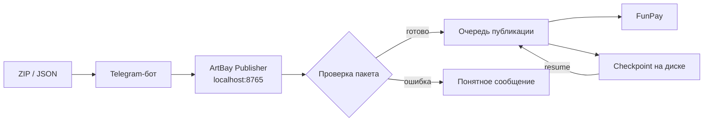

<div align="center">
  

  <p>
    <a href="README.md"><b>Русский</b></a> ·
    <a href="README_EN.md">English</a>
  </p>

  <p>
    
    
    
    
    
  </p>

  <h3>Локальный мост между Telegram и FunPay для безопасной массовой публикации лотов</h3>
</div>

> [!IMPORTANT]
> ArtBay Publisher — независимый инструмент RovelLabs. Проект не является официальным продуктом FunPay или Telegram. Используйте автоматизацию ответственно и соблюдайте правила площадок.

## ✨ Что умеет

| Возможность | Что получает пользователь |
|---|---|
| 🔐 Безопасное подключение | Telegram Bot Token и `golden_key` проверяются до сохранения и не показываются обратно в интерфейсе |
| 📦 Универсальный импорт | Одиночные ZIP, ZIP с сотнями вложенных пакетов, `lots.json`, `artbay-batch.json` и JSON без изображений |
| 🚀 Массовая публикация | Очередь с прогрессом, паузой, продолжением и восстановлением после перезапуска |
| 🧠 Умная обработка | Дубликаты и заполненные категории пропускаются отдельно от настоящих ошибок |
| ⏯ Управление очередью | `/stop` ставит на паузу, `/resume` продолжает, `/cancel` окончательно удаляет очередь |
| 🛍 Управление лотами | Просмотр, цены, включение/выключение, клонирование, экспорт, удаление и rollback |
| 🖼 Работа с изображениями | PNG, JPG, WEBP и GIF; одинаковые картинки повторно не загружаются |
| 🏠 Local-first | Панель работает только на `127.0.0.1:8765`, данные остаются на компьютере пользователя |

## 🧭 Как это работает



## 🚀 Быстрый старт

1. Откройте страницу [Releases](https://github.com/RovelLabs/ArtBay-Publisher-FunPay-bot-/releases/latest).
2. Скачайте `ArtBayPublisher-v4.0.2-windows-x64.zip` и распакуйте архив.
3. Запустите `UPDATE_AND_START.bat` или `ArtBayPublisher.exe`.
4. В локальной панели вставьте Telegram Bot Token и пройдите привязку владельца.
5. Добавьте cookie `golden_key` от своего FunPay-аккаунта.
6. Отправьте боту ZIP/JSON и подтвердите публикацию.

> [!TIP]
> Перед обновлением не удаляйте `%APPDATA%\ArtBayPublisher`: там находятся настройки, checkpoint очереди и резервные копии.

## 📦 Форматы пакетов

### Один лот

```text
my-lot.zip
├── lot.json
└── cover.png
```

Минимальный `lot.json`:

```json
{
  "version": 2,
  "category_path": "Roblox Studio > Услуги",
  "title_ru": "💻 ROBLOX STUDIO | LUA / LUAU СКРИПТ",
  "title_en": "💻 ROBLOX STUDIO | LUA / LUAU SCRIPT",
  "description_ru": "Описание услуги",
  "description_en": "Service description",
  "payment_msg_ru": "Спасибо за покупку! Пришлите ТЗ.",
  "payment_msg_en": "Thank you! Please send your requirements.",
  "price": 199,
  "active": true,
  "image_files": ["cover.png"]
}
```

### Большая пачка

Внешний ZIP может содержать сотни готовых ZIP-пакетов:

```text
bulk.zip
├── 0001_lot.zip
├── 0002_lot.zip
├── 0003_lot.zip
└── ...
```

Также поддерживаются папки с `lot.json`, общий `lots.json` / `artbay-batch.json` и пакет изображений вида `LOT_ID.png`.

Готовые примеры находятся в каталоге [`examples`](examples).

## 🤖 Команды Telegram

| Команда | Назначение |
|---|---|
| `/lots` | Показать текущие лоты |
| `/orders` | Последние заказы |
| `/stats` | Статистика |
| `/categories` | Поиск категории FunPay |
| `/price ID 199` | Изменить цену одного лота |
| `/prices -15%` | Массово изменить цены |
| `/on ID` / `/off ID` | Включить или выключить лот |
| `/clone ID` | Клонировать лот |
| `/export ID` | Выгрузить лот в ZIP |
| `/delete ID` | Удалить с предварительным backup |
| `/rollback` | Откатить последнее изменение |
| `/stop` | Поставить массовую очередь на паузу |
| `/resume` | Продолжить сохранённую очередь |
| `/cancel` | Окончательно отменить и удалить очередь |

## 🛡 Безопасность

- Панель слушает только `127.0.0.1` и защищена локальным ключом.
- Секреты не возвращаются в HTML и очищаются из пользовательских ошибок.
- ZIP проверяется на path traversal и лимиты распаковки.
- Перед опасными изменениями создаются локальные backup-записи.
- Репозиторий не содержит Telegram-токенов, cookies, конфигурации пользователя и пакетов товаров.

Сообщить о проблеме безопасности: см. [`SECURITY.md`](SECURITY.md).

## 🧑‍💻 Сборка из исходников

Требуется Go 1.23+.

```powershell
go test ./...
go build -trimpath -ldflags="-s -w -H=windowsgui" -o ArtBayPublisher.exe .
```

## 🗺 Статус проекта

- Текущая версия: **4.0.2**
- Основная платформа: **Windows 10/11 x64**
- Интерфейс: **локальная web-панель + Telegram**
- История изменений: [`CHANGELOG.md`](CHANGELOG.md)

## 👨‍🚀 Разработчики

<table>
  <tr>
    <td align="center">
      <a href="https://github.com/RovelLabs"><b>RovelLabs</b></a><br>
      <sub>Разработка · архитектура · поддержка</sub>
    </td>
  </tr>
</table>

## 📄 Правовой статус

Copyright © 2026 RovelLabs. Все права защищены. Условия использования исходного кода описаны в [`LICENSE`](LICENSE).
