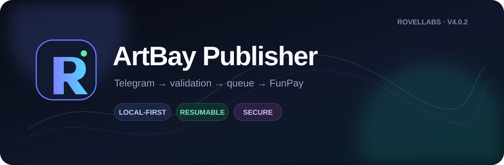
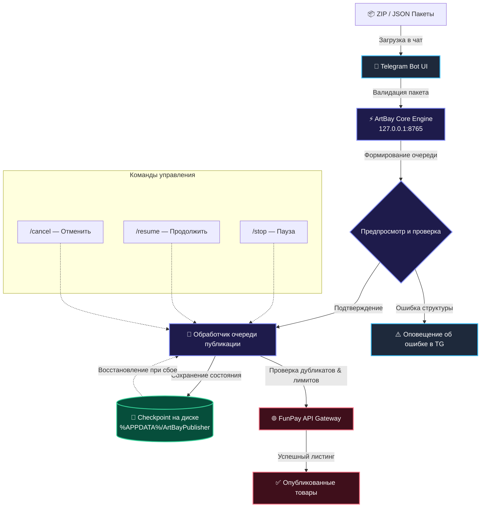

<div align="center">
  <a href="https://github.com/RovelLabs/ArtBay-Publisher-FunPay-bot-">
    
  </a>

  <br><br>

  <p align="center">
    <a href="README.md"><b>🇷🇺 Русский</b></a>&nbsp;&nbsp;•&nbsp;&nbsp;
    <a href="README_EN.md"><b>🇬🇧 English</b></a>
  </p>

  <p align="center">
    <a href="https://github.com/RovelLabs/ArtBay-Publisher-FunPay-bot-/releases/latest"></a>
    <a href="https://go.dev/"></a>
    
    
    
    <a href="LICENSE"></a>
  </p>

  <p align="center">
    <b>Высокопроизводительный локальный мост между Telegram и FunPay для умной и безопасной массовой публикации товаров.</b>
  </p>
</div>

---

> [!IMPORTANT]
> **ArtBay Publisher** — независимая программная разработка команды **RovelLabs**. Проект не аффилирован и не является официальным сервисом FunPay или Telegram. Используйте инструменты автоматизации в соответствии с правилами площадок.

---

## 📑 Оглавление

- [✨ Ключевые возможности](#-ключевые-возможности)
- [🧭 Архитектура работы](#-архитектура-работы)
- [🚀 Быстрый старт](#-быстрый-старт)
- [🤖 Команды Telegram-бота](#-команды-telegram-бота)
- [📦 Форматы пакетов и манифестов](#-форматы-пакетов-и-манифестов)
- [🛡 Безопасность и Local-First](#-безопасность-и-local-first)
- [🧑‍💻 Сборка из исходного кода](#-сборка-из-исходного-кода)
- [👨‍🚀 Разработчики и поддержка](#-разработчики-и-поддержка)
- [📄 Лицензия](#-лицензия)

---

## ✨ Ключевые возможности

| Функция | Описание и преимущества |
| :--- | :--- |
| 🚀 **Массовая публикация** | Публикуйте сотни предложений за считанные минуты через удобную очередь с предпросмотром и контролем ошибок. |
| ⏯ **Управление очередью** | Команды `/stop` (пауза), `/resume` (возобновление) и `/cancel` (полная отмена и очистка checkpoint на диске). |
| 🛡 **Анти-дубликаты и лимиты** | Распознавание уже опубликованных предложений и защита от переполнения категорий FunPay без прерывания всей очереди. |
| 🔐 **100% Local-First & Zero-Leak** | Панель управления доступна строго на `127.0.0.1:8765`. Все токены и `golden_key` шифруются и не передаются третьим лицам. |
| 🖼 **Умный медиа-пайплайн** | Поддержка `PNG`, `JPG`, `WEBP`, `GIF`. SHA-256 хеширование предотвращает повторную загрузку одинаковых картинок. |
| 📦 **Любые форматы импорта** | Поддерживает одиночные ZIP, пачки вложенных ZIP, файлы `lots.json`, `artbay-batch.json` и пакеты обновлений. |
| 🛍 **Полный менеджмент лотов** | Изменение цен (включая процентные `/prices -10%`), включение/выключение, клонирование, экспорт в ZIP и rollback. |
| ⚡ **Устойчивость к сбоям** | Checkpoint сохраняется на диске после каждого обработанного лота — при перезапуске процесс продолжается с места остановки. |

---

## 🧭 Архитектура работы



---

## 🚀 Быстрый старт

### 1. Загрузка релиза
Перейдите на страницу **[Releases](https://github.com/RovelLabs/ArtBay-Publisher-FunPay-bot-/releases/latest)** и выберите один из двух вариантов:

| Вариант | Файл | Когда использовать |
| :--- | :--- | :--- |
| 🛠 **Установщик (рекомендуется)** | `ArtBayPublisher-Setup-4.0.4.exe` | Сам создаёт папку установки, ярлыки в меню «Пуск» и на рабочем столе, регистрирует программу в «Установка и удаление программ». Права администратора не нужны. |
| 📦 **Портативная версия** | `ArtBayPublisher-v4.0.4-windows-x64.zip` | Без установки — просто распакуйте архив и запускайте `.exe` откуда угодно (например, с флешки). |

### 2. Установка и запуск

**Через установщик:**
1. Запустите `ArtBayPublisher-Setup-4.0.4.exe` и пройдите мастер установки (доступен русский язык).
2. По завершении программа запустится автоматически — ярлык также появится в меню «Пуск».

**Портативная версия:**
1. Распакуйте архив в удобную папку (например, `C:\ArtBayPublisher`).
2. Запустите файл **`UPDATE_AND_START.bat`** или **`ArtBayPublisher.exe`**.

В обоих случаях в браузере автоматически откроется локальная панель: **`http://127.0.0.1:8765`**.

> [!NOTE]
> Все зависимости уже встроены в `.exe` — Go-рантайм и HTTP-сервер собраны внутрь одного файла. Устанавливать Python, Node.js, WebView2 или другие компоненты не требуется.

### 3. Первичная настройка
1. **Telegram Bot Token**: Создайте бота через [@BotFather](https://t.me/BotFather), скопируйте токен и вставьте в панель.
2. **Привязка владельца**: Нажмите кнопку привязки или перейдите по сгенерированной deep-link ссылке в вашего бота.
3. **FunPay golden_key**: Скопируйте cookie `golden_key` из браузера в личном кабинете FunPay и сохраните в панели.

### 4. Публикация первого лота
- Перетащите ZIP-архив с товаром прямо в диалог с ботом в Telegram.
- Бот покажет предпросмотр лота (название, цену, категорию, фото).
- Нажмите кнопку **«Опубликовать»** — лот моментально появится на бирже FunPay!

> [!TIP]
> Все персональные данные, очередь публикаций и бэкапы хранятся в защищенной директории `%APPDATA%\ArtBayPublisher`. При обновлении программы эта папка сохраняется.

---

## 🤖 Команды Telegram-бота

Управляйте магазином и процессами публикации прямо из мессенджера:

| Команда | Пример | Действие |
| :--- | :--- | :--- |
| `/lots` | `/lots` | Показать список активных и неактивных предложений |
| `/orders` | `/orders` | Показать последние полученные заказы и их статус |
| `/stats` | `/stats` | Сводка статистики магазина и баланса |
| `/categories` | `/categories Roblox` | Интерактивный поиск ID категорий и разделов FunPay |
| `/price` | `/price 1234567 299` | Изменить стоимость конкретного лота по его ID |
| `/prices` | `/prices -10%` или `+50` | Массовое изменение цен на все лоты (в % или рублях) |
| `/on` / `/off` | `/on 1234567` | Быстрое включение или скрытие лота |
| `/clone` | `/clone 1234567` | Клонировать существующий лот с сохранением описания |
| `/export` | `/export 1234567` | Выгрузить лот обратно в готовый ZIP-архив |
| `/delete` | `/delete 1234567` | Удалить лот (с автоматическим созданием резервной копии) |
| `/rollback` | `/rollback` | Откатить последнее действие редактирования/удаления |
| `/stop` | `/stop` | Поставить текущую массовую очередь на паузу |
| `/resume` | `/resume` | Возобновить выполнение очереди с сохраненного места |
| `/cancel` | `/cancel` | Полностью отменить очередь и удалить прогресс |
| `/version` | `/version` | Показать текущую версию движка и статус подключения |

---

## 📦 Форматы пакетов и манифестов

### 📁 1. Одиночный ZIP-пакет (`lot.zip`)
```text
my-awesome-product.zip
├── lot.json          # Манифест с параметрами и описанием
└── cover.png         # Обложка товара (PNG, JPG, WEBP, GIF)
```

Пример `lot.json`:
```json
{
  "version": 2,
  "category_path": "Roblox Studio > Услуги",
  "title_ru": "💻 ROBLOX STUDIO | LUA / LUAU СКРИПТ ЛЮБОЙ СЛОЖНОСТИ",
  "title_en": "💻 ROBLOX STUDIO | LUA / LUAU CUSTOM SCRIPT",
  "description_ru": "Быстрая разработка скриптов и систем для ваших плейсов в Roblox Studio.",
  "description_en": "High-quality Roblox Studio scripting and Luau systems for your games.",
  "payment_msg_ru": "Спасибо за покупку! Пожалуйста, отправьте ТЗ в чат заказа.",
  "payment_msg_en": "Thank you for your purchase! Please describe your task in the order chat.",
  "price": 249,
  "active": true,
  "image_files": [
    "cover.png"
  ]
}
```

### 🗂 2. Массовый ZIP-пакет сотен лотов (`bulk.zip`)
Внешний архив может содержать сотни отдельных архивов:
```text
bulk-upload.zip
├── 001_lot.zip
├── 002_lot.zip
├── 003_lot.zip
└── ...
```

---

## 🛡 Безопасность и Local-First

- 🔒 **Локальный Web-сервер**: Приложение работает исключительно на `127.0.0.1:8765` без внешних портов.
- 🔑 **Защита от утечки секретов**: Токены Telegram и cookie FunPay хранятся в защищенном виде и никогда не отображаются в исходном коде веб-страницы.
- 🗜 **Zip Slip & Traversal Protection**: Все входящие архивы проверяются на корректность путей и лимиты размера перед распаковкой.
- 💾 **Автоматический бэкап**: Перед удалением или обновлением лотов создаются снимки в локальной БД для возможности отката (`/rollback`).

---

## 🧑‍💻 Сборка из исходного кода

Для самостоятельной сборки потребуется установленный **Go 1.23+**:

```powershell
# 1. Клонирование репозитория
git clone https://github.com/RovelLabs/ArtBay-Publisher-FunPay-bot-.git
cd ArtBay-Publisher-FunPay-bot-

# 2. Запуск тестов и статического анализа
go test -v ./...
go vet ./...

# 3. (опционально) Встраивание иконки и версии в .exe
go install github.com/tc-hib/go-winres@latest
go-winres make

# 4. Сборка исполняемого файла для Windows (без отображения консоли)
go build -trimpath -ldflags="-s -w -H=windowsgui" -o ArtBayPublisher.exe .

# 5. (опционально) Сборка установщика — требуется Inno Setup 6
iscc installer\ArtBayPublisher.iss
```

---

## 👨‍🚀 Разработчики и поддержка

<table align="center">
  <tr>
    <td align="center" width="220">
      <a href="https://github.com/RovelLabs">
        <br />
        <sub><b>RovelLabs</b></sub>
      </a><br />
      <sub>Архитектура · Core · UI</sub>
    </td>
  </tr>
</table>

- **GitHub Организация**: [@RovelLabs](https://github.com/RovelLabs)
- **Репозиторий**: [ArtBay-Publisher-FunPay-bot-](https://github.com/RovelLabs/ArtBay-Publisher-FunPay-bot-)
- **Сообщить о баге / Предложить идею**: [Создать Issue](https://github.com/RovelLabs/ArtBay-Publisher-FunPay-bot-/issues)

---

## 📄 Лицензия

Copyright © 2026 **RovelLabs**. Все права защищены.  
Исходный код распространяется на условиях [Source-Available License](LICENSE).
