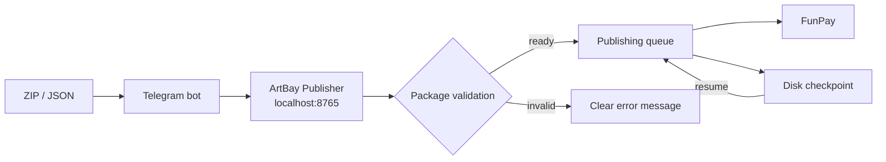

<div align="center">
  

  <p>
    <a href="README.md">Русский</a> ·
    <a href="README_EN.md"><b>English</b></a>
  </p>

  <p>
    
    
    
    
    
  </p>

  <h3>A local-first Telegram ↔ FunPay bridge for reliable bulk offer publishing</h3>
</div>

> [!IMPORTANT]
> ArtBay Publisher is an independent RovelLabs project. It is not an official FunPay or Telegram product. Use automation responsibly and follow the platforms' rules.

## ✨ Highlights

| Feature | What it does |
|---|---|
| 🔐 Secure connection | Validates the Telegram Bot Token and FunPay `golden_key` before saving; stored secrets are never rendered back |
| 📦 Flexible imports | Accepts single-lot ZIPs, large nested ZIP archives, `lots.json`, `artbay-batch.json`, and image-free JSON updates |
| 🚀 Bulk publishing | Durable progress, pause/resume, cancellation, and recovery after an app restart |
| 🧠 Smart failures | Separates duplicates and full categories from genuine per-offer errors |
| ⏯ Queue controls | `/stop` pauses, `/resume` continues, and `/cancel` permanently discards a saved queue |
| 🛍 Offer management | Browse, price, enable/disable, clone, export, delete, and roll back offers |
| 🖼 Image support | PNG, JPG, WEBP, and GIF with SHA-256-based image reuse |
| 🏠 Local-first | The dashboard is bound to `127.0.0.1:8765`; user data stays on the local machine |

## 🧭 Architecture



## 🚀 Quick start

1. Open the [latest release](https://github.com/RovelLabs/ArtBay-Publisher-FunPay-bot-/releases/latest).
2. Download and extract `ArtBayPublisher-v4.0.2-windows-x64.zip`.
3. Run `UPDATE_AND_START.bat` or `ArtBayPublisher.exe`.
4. Enter your Telegram Bot Token in the local dashboard and pair the owner account.
5. Add the `golden_key` cookie from your own FunPay account.
6. Send a ZIP/JSON package to the bot and confirm publishing.

> [!TIP]
> Do not delete `%APPDATA%\ArtBayPublisher` during upgrades. It contains settings, queue checkpoints, and local backups.

## 📦 Package format

### Single offer

```text
my-lot.zip
├── lot.json
└── cover.png
```

```json
{
  "version": 2,
  "category_path": "Roblox Studio > Services",
  "title_ru": "💻 ROBLOX STUDIO | LUA / LUAU СКРИПТ",
  "title_en": "💻 ROBLOX STUDIO | LUA / LUAU SCRIPT",
  "description_ru": "Описание услуги",
  "description_en": "Service description",
  "payment_msg_ru": "Спасибо за покупку! Пришлите ТЗ.",
  "payment_msg_en": "Thank you! Please send your requirements.",
  "price": 199,
  "active": true,
  "image_files": ["cover.png"]
}
```

### Bulk archive

```text
bulk.zip
├── 0001_lot.zip
├── 0002_lot.zip
├── 0003_lot.zip
└── ...
```

Folder-based packages, shared `lots.json` / `artbay-batch.json` manifests, and `LOT_ID.png` image replacement packs are supported as well. See [`examples`](examples) for ready-to-edit manifests.

## 🤖 Telegram commands

| Command | Action |
|---|---|
| `/lots` | Show current offers |
| `/orders` | Show recent orders |
| `/stats` | Show statistics |
| `/categories` | Find a FunPay category |
| `/price ID 199` | Change one offer's price |
| `/prices -15%` | Apply a bulk price change |
| `/on ID` / `/off ID` | Enable or disable an offer |
| `/clone ID` | Clone an offer |
| `/export ID` | Export an offer as ZIP |
| `/delete ID` | Delete after creating a backup |
| `/rollback` | Roll back the last change |
| `/stop` | Pause the bulk queue |
| `/resume` | Resume a saved queue |
| `/cancel` | Permanently cancel and delete a queue |

## 🛡 Security

- The dashboard only listens on `127.0.0.1` and uses a local access key.
- Stored secrets are never rendered in HTML and are redacted from user-facing errors.
- ZIP extraction rejects path traversal and enforces size limits.
- Local backup records are created before destructive offer changes.
- This repository excludes user configs, tokens, cookies, logs, backups, and product packages.

See [`SECURITY.md`](SECURITY.md) for responsible reporting.

## 🧑‍💻 Build from source

Go 1.23+ is required.

```powershell
go test ./...
go build -trimpath -ldflags="-s -w -H=windowsgui" -o ArtBayPublisher.exe .
```

## 🗺 Project status

- Current version: **4.0.2**
- Primary platform: **Windows 10/11 x64**
- Interface: **local web dashboard + Telegram**
- Changes: [`CHANGELOG.md`](CHANGELOG.md)

## 👨‍🚀 Developers

<table>
  <tr>
    <td align="center">
      <a href="https://github.com/RovelLabs"><b>RovelLabs</b></a><br>
      <sub>Development · architecture · maintenance</sub>
    </td>
  </tr>
</table>

## 📄 Legal

Copyright © 2026 RovelLabs. All rights reserved. See [`LICENSE`](LICENSE) for source-use terms.
